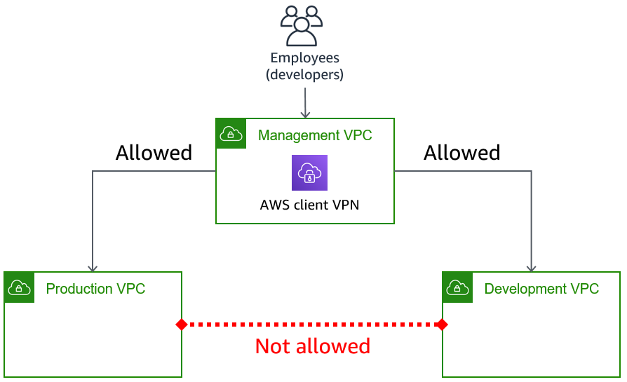
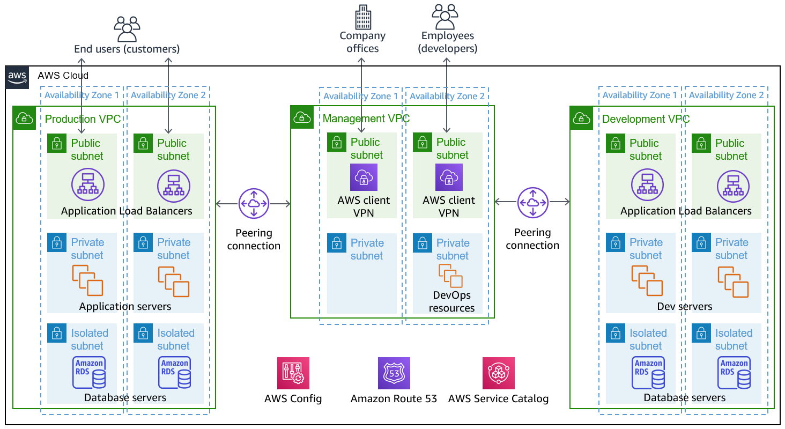

// Add steps as necessary for accessing the software, post-configuration, and testing. Don’t include full usage instructions for your software, but add links to your product documentation for that information.
//Should any sections not be applicable, remove them

//== Test the deployment
// If steps are required to test the deployment, add them here. If not, remove the heading

:xrefstyle: short

== Post-deployment steps
// If post-deployment steps are required, add them here. If not, remove the heading

=== Connect to the VPN

//TODO Shivansh, Paul, This section is a series of actions. Please add a period-space before each action to number the steps. (Do the same anywhere else in the doc where you walk people through how to do something.)

To route into the private subnets in the VPCs, you connect to the VPN. The {partner-product-name} Quick Start deploys a client VPN endpoint in the management VPC that sends NAT traffic over peering connections into the production and development VPCs. The management VPC acts as a hub VPC for networking into other VPCs. The development and production environments do not communicate with each other.

[#vpn1]
.VPN routing rules in the {partner-product-short-name} on AWS
[link=VPNRoutingDiagram.png]


After the deployment is complete, go to the https://console.aws.amazon.com/vpc/home?#ClientVPNEndpoints:sort=clientVpnEndpointId[Client VPN endpoint section in the AWS VPC web console]. Select the Client VPN endpoint listed, and choose *Download Client Configuration*. Your browser downloads a *downloaded-client-config.ovpn* file.

image::../images/downloadclientconfig.png[VPN]

//TODO Shivansh, Paul, Please continue adding figure captions, figure borders, etc., for all remaining images (as I've been done in several cases already). For each figure, include a reference in the nearby text, using the <<xx>> format. For details, see https://w.amazon.com/bin/view/AWS_Quick_Starts/docs2_0#HLinktoafigureortable Thanks!

Now go to the AWS S3 web console and open the bucket prefixed `awsstartupblueprintstack-clientvpnvpnconfigbucket`. You will see five files listed. Download the `client1.domain.tld.key` and `client1.domain.tld.crt`. The other three files are the CA chain and server key/cert. You need those if you want to create additional client certificates later on. For now, you just need `client1.domain.tld.key` and `client1.domain.tld.crt`.

At this point we have to edit make some tweaks to the downloaded-client-config.ovpn file so open it in a text editor:

Add the following lines to the bottom of the file, replace the contents of the two files inside the respective `<cert>` and `<key>` sections.


```
<cert>
Contents of client certificate (client1.domain.tld.crt) file
</cert>

<key>
Contents of private key (client1.domain.tld.key) file
</key>
```

Save the downloaded-client-config.ovpn. You should be able to open/import that file with any OpenVPN client. 

AWS offers is own lightweight VPN client that works on most operating systems. https://docs.aws.amazon.com/vpn/latest/clientvpn-user/connect-aws-client-vpn-connect.html[Install and usage instructions here.]

Usage instructions for other OpenVPN clients like https://openvpn.net/download-open-vpn/[OpenVPN Connect] can be found https://docs.aws.amazon.com/vpn/latest/clientvpn-user/connect.html[in our docs]


//== Test the deployment
// If steps are required to test the deployment, add them here. If not, remove the heading


//== Best practices for using {partner-product-short-name} on AWS
// Provide post-deployment best practices for using the technology on AWS, including considerations such as migrating data, backups, ensuring high performance, high availability, etc. Link to software documentation for detailed information.

//_Add any best practices for using the software._

== Security and compliance
// Provide post-deployment best practices for using the technology on AWS, including considerations such as migrating data, backups, ensuring high performance, high availability, etc. Link to software documentation for detailed information.

The Blueprint deploys the following AWS Config https://docs.aws.amazon.com/config/latest/developerguide/conformance-packs.html[conformance packs^]:

* https://docs.aws.amazon.com/config/latest/developerguide/operational-best-practices-for-pci-dss.html[Operational Best Practices for PCI-DSS-3.2.1^]
* https://docs.aws.amazon.com/config/latest/developerguide/operational-best-practices-for-aws-identity-and-access-management.html[Operational Best Practices For AWS Identity And Access Management^]
* https://docs.aws.amazon.com/config/latest/developerguide/operational-best-practices-for-amazon-s3.html[Operational Best Practices For Amazon S3^]
* https://docs.aws.amazon.com/config/latest/developerguide/operational-best-practices-for-nist-csf.html[Operational Best Practices for NIST CSF^]
* https://docs.aws.amazon.com/config/latest/developerguide/aws-control-tower-detective-guardrails.html[AWS Control Tower Detective Guardrails Conformance Pack^]

These conformance packs create a number of AWS Config rules that regularly evaluate resources in your account against security best practices. When AWS Config finds an offending resource, it flags it for your review in the AWS Config console. Any resources you created in your account before you deployed the blueprint are also scanned during the next AWS Config rule evaluation. This can be handy to help identify resources you are already using, or create in the future, that fall short of the best practices defined in the AWS Config packs.

Visit the AWS Config console and get a feel for how AWS Config tracks resources, rules, and remediation. Every resource—from S3 buckets, to IAM resources, to EC2 hosts—has its history tracked in a way that you can consume and understand more easily than, say, raw CloudTrail events.

For example, the Operational Best Practices for NIST-CSF Conformance pack comes with 93 rules. One of those rules—`encrypted-volumes-conformance-pack`, highlighted in <<conformance_pack0>>—checks whether EBS volumes that are in an attached state are encrypted. 

[#conformance_pack0]
.Rules list in the Operational Best Practices for NIST-CSF conformance pack
[link=images/conformancepacks_0.png]
image::../images/conformancepacks_0.png[Conformance packs2]

If you drill into the `encrypted-volumes-conformance-pack` rule, you see a list of relevant resources and their compliance status. 

[#conformance_pack1]
.Rule details and resources 
[link=images/conformancepacks_1.png]
image::../images/conformancepacks_1.png[Conformance packs1]

You can update the AWS Config delivery channel to include an Amazon SNS topic to send email or text notifications when resources are flagged. More sophisticated approaches might include regularly reviewing AWS Config reports, using AWS Config's automatic remediation capabilities, or integrating AWS Config with security ticketing or security event and incident management (SEIM) practices. 

=== Operational Best Practices for PCI-DSS-3.2.1 pack

While payment card industry (PCI) might not be a concern for every user of this Quick Start, many companies store, transmit, or process payment data. Whether or not you have PCI requirements, the PCI security conformance pack has over 140 rules that capture a number of best practices that any user should consider implementing.

If you do have PCI needs, read https://docs.aws.amazon.com/config/latest/developerguide/operational-best-practices-for-pci-dss.html[Operational Best Practices for PCI DSS 3.2.1]. For every AWS Config rule included in a conformance pack, there's a corresponding PCI control ID along with AWS guidance for each check. This conformance pack was validated by AWS Security Assurance Services LLC (AWS SAS). AWS SAS is a team of PCI qualified security assessors (QSAs), HITRUST certified common security framework practitioners (CCSFPs), and compliance professionals certified to provide guidance and assessments for various industry frameworks. AWS SAS professionals designed this conformance pack to enable customers to align to a subset of the U.S. Health Insurance Portability and Accountability Act (HIPAA).

//TODO Shivansh/Paul, I presume that the HIPAA reference carries over from Biotech, yes? FYI, the Biotech Blueprint guide has only the first sentence of this paragraph. Can we delete all the other sentences? If so, please do.

WARNING: AWS Config conformance packs provide a general-purpose compliance framework designed to enable you to create security, operational or cost-optimization governance checks using managed or custom AWS Config rules and AWS Config remediation actions. Conformance packs, as sample templates, are not designed to fully ensure compliance with a specific governance or compliance standard. You are responsible for making your own assessment of whether your use of the services meets applicable legal and regulatory requirements.
       
== Other useful information
//Provide any other information of interest to users, especially focusing on areas where AWS or cloud usage differs from on-premises usage.

=== Where to go from here?
After you are connected to the VPN, you essentially have a private encrypted channel into your new VPCs. You can connect to any resources you launch into your VPCs using private IP addresses without using insecure (public) bastion hosts. 

<<architecture2>> shows examples of the sorts of resources you might deploy into your VPCs and subnets. If you aren't sure which VPC or subnets you should deploy resources into, see the link:#_faq[FAQ] section for guidance and more examples. 

[#architecture2]
.Example architecture for {partner-product-short-name} with deployed resources


=== (Optional) DNS setup
A private DNS is setup by the Blueprint with `.corp` (default) as the apex domain using https://console.aws.amazon.com/route53/v2/home#Dashboard[Amazon Route 53 in your account]. From there, you can create private A or CNAME records to any private resources you create. 

For example, you may decide to launch a development server that gets a private IP like `10.60.0.198`. Instead of you having to remember that IP, you can create an 'A' record in the .corp Route 53 hosted zone for `pauls-machine.corp` to the private IP `10.60.0.198`. Resources in all three VPCs, and clients connected to the Client VPN Endpoint, will then all be able to resolve `pauls-machine.corp` from a browser, terminal, api call, etc.

=== (Optional) Enable Fintech Blueprint Informatics Catalog

All of the Fintech tooling made available through the Blueprint is deployed through AWS Service Catalog as the `Fintech Blueprint Catalog`. 

Service Catalog requires that you explicitly give permissions to individual IAM users/groups/roles to launch products from a Service Catalog portfolio. 

To grant that permission you first need to visit the https://console.aws.amazon.com/servicecatalog/home?#portfolios?activeTab=localAdminPortfolios[Service Catalog Portfolio Console]. 

Click on the `Fintech Blueprint Informatics Catalog` portfolio and then the `Groups, roles, and users` tab. 

image::../images/service-catalog-permission.png[scpermission,width=100%,height=100%]

Click on the `Add groups, users, and roles` button and select any IAM users/groups/roles that you want grant permissions to. *Make sure you add yourself.*

Anyone you just added can now visit the https://us-east-1.console.aws.amazon.com/servicecatalog/home?isSceuc=true&region=us-east-1#/products['Products list' section of the Service Catalog console] and deploy any of the tools listed.

For example, you or another user could now go to the Service Catalog console and deploy the SWIFT Client Connectivity solution:

image::../images/swiftservicecatalog.png[swiftservicecatalog,width=100%,height=100%]

Please reference the following documentation pages for tool specific deployment and usage instructions:

==== SWIFT Client Connectivity on AWS

Deploying this product from the Fintech Blueprint Service Catalog portfolio will stand up an AWS CodePipeline that automatically deploys the https://aws-quickstart.github.io/quickstart-swift-digital-connectivity/[SWIFT Client Connectivity^], a standardized environment for connecting to the SWIFT network, into your AWS account. It takes about 4-5 minutes for Service Catalog to deploy the CodePipeline at which point it will report "Available". While the CodePipeline and supporting assets are available, the Pipeline itself does the bulk of the deployment and takes about 23 minutes. You can observe the progress in the Code Pipeline console. 

image::../images/swift_codepipeline.png[swift_codepipeline,width=100%,height=100%]


=== (Optional) Delete the default VPC

Every new account created in AWS comes with a default VPC. It's listed in the VPC console list along with the production, management, and development VPCs created by this Quick Start. 

image::../images/defaultvpc_0.png[Config,width=100%,height=100%]

The default VPC consists of public subnets in every Availability Zone. It is a fundamentally insecure VPC and should not be used. 

TIP: If you have a new account and have never launched anything into the default VPC, delete the default VPC and use only the VPCs created by the Quick Start. If you've already launched resources into the default VPC, migrate them to the VPCs created by the Quick Start, and then delete the default VPC. By deleting the default VPC, you reduce the chances of a user launching a resource into an exposed public subnet. 

== Region restriction capabilities 

A common request from startups using AWS is to restrict all IAM actions to specific Regions. For example, you may want users to create EC2 instances or S3 buckets in EU Regions only. This could be for compliance reasons or because it's a best practice to keep resources out of Regions you never intend to use. 

If you have a single AWS account, the best way to enforce Region restrictions is with an https://docs.aws.amazon.com/IAM/latest/UserGuide/access_policies_boundaries.html[IAM permission boundary]. IAM permission boundaries are similar to, but distinct from, identity polices that you may be familiar with. An entity's permissions boundary allows it to perform only the actions that are allowed by both its identity-based policies *and* it's permissions boundaries. This means that even the broadest identity-based permission polices like 'arn:aws:iam::aws:policy/AdministratorAccess', which gives * access to *, will still be denied if the principal's permission boundary does not allow it.

The `RegionRestriction` class configured in 'lib/aws-startup-blueprint-stack.ts' creates just such an IAM permission boundary restriction actions to the regions you specify:

For example:

```typescript
      new RegionRestriction(this, 'RegionRestriction', {
        AllowedRegions: ["eu-central-1","eu-west-1","eu-west-3", "eu-south-1", "eu-north-1"]
      });  
```


We have added some helper context variables (`apply_EU_RegionRestriction` and `apply_US_RegionRestriction`) inside the the `cdk.json` file. Setting one of those to `"true"` and running `cdk deploy` again will apply the region restriction.

In order for the permission boundary to have any effect, it needs to be attached to all existing and future IAM users and roles. As a best practice, you should always attach this permission boundary when creating any future IAM user or role. While a best practice, sometimes good intentions are forgotten. To enforce the permission boundary, the `RegionRestriction` class also creates an AWS Config Rule and Remediation to detect and automatically fix a missing permission boundary to any existing, updated, or future IAM principals. 

If you visit the AWS Config Rules console, find and click on the rule titled `AwsFintechBlueprint-RegionRestriction...`

image::../images/regionrestriction_config0.png[Config,width=100%,height=100%]

The Config Rule will have evaluated all of your IAM users and roles and listed their compliance status. You can quickly remediate a non-compliant resource by selecting the radio button next to it and clicking the 'Remediate' button. That will immediately apply the service control policy and that user or role will no longer be able to perform any action outside of the region you specified. 

image::../images/regionrestriction_config1.png[Config,width=100%,height=100%]

After the remediation is complete, AWS CloudTrail will eventually trigger the AWS Config rule. CloudTrail tells AWS Config that the IAM principal has been updated and that it's time to reevaluate the offending resource. (This takes about 15 minutes.) Because the boundary has been applied, the reevaluation reports the role or user as compliant.


*What about automatically remediating resources?* The Blueprint intentionally leaves the remediation configuration set to "Manual" instead of "Automatic". This is in the event you have existing IAM users or roles. Automatically applying the remediation and attaching the permission boundary will impact those existing IAM principals' permissions. Verify if any of the flagged IAM principals depend on any nonapproved Regions before applying the boundary. If you are working in a new account or are unconcerned about the impact on existing IAM principals, turn on automatic remediation, as follows: 

Click the edit button in the "Remediation Action" section of the `AwsFintechBlueprint-RegionRestriction` Config Rule. 

image::../images/regionrestriction_config2.png[Config,width=100%,height=100%]

WARNING: Turning on automatic remediation will impact existing IAM users and roles not created by the Blueprint itself.

//TODO Shivansh, Paul, Please briefly clarify the "impact" so that it's clear why this is a warning.

Choose the *Automatic Remediation* radio button, and then choose *Save changes.*

image::../images/regionrestriction_config3.png[Config,width=100%,height=100%]


=== Region restriction capabilities in multiaccount configurations:

In a multiaccount setup, service control polices (SCPs) are superior to permission boundaries. SCPs are applied across an entire account and don't need to be individually attached to IAM principals. Note that SCPs can only take effect on your subaccounts. So if you have only one account, SCPs can't help. Thats just fine! The permission boundary and AWS Config approach are enough restrict Regions in a single account setup. But when the time comes to create a new account, the Blueprint has already created a Region restricting SCP that is automatically applied to any new account you create.

You can take a look at the service control policy in the https://console.aws.amazon.com/iam/home?organizations/ServiceControlPolicies/#/organizations/ServiceControlPolicies[IAM Console]

TIP: The SCP created by the applies only to your subaccounts if and when you create them.

//TODO Shivansh, Paul, What word should follow "the" in this tip?

image::../images/regionrestriction_config4.png[Config,width=100%,height=100%]

//TODO Shivansh, Paul, Throughout the doc, please give each image its own unique placeholder text in brackets. Here, for example, "Config" appears for two .png files in a row.